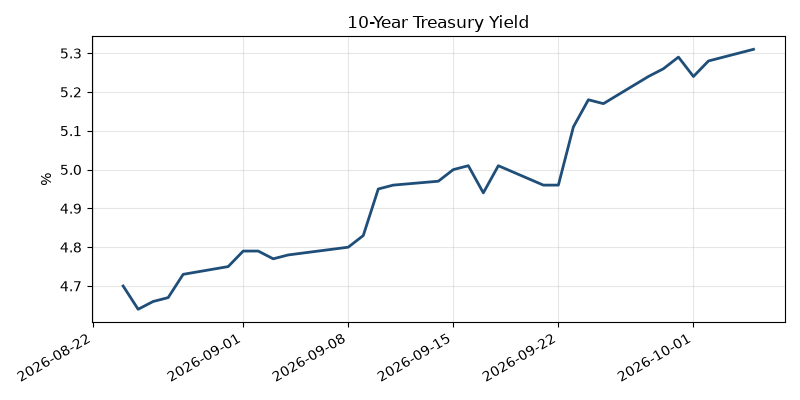

> **Review before publishing:**
> - check/unsourced_number: Debt Markets: $631 million

## The Numbers

*Rates as of Oct 5 close.*

- **10Y Treasury:** 5.31% (+3 bps)
- **5Y Treasury:** 5.06% (unch)
- **SOFR:** 3.88% (+1 bps)
- **Fed funds:** 3.88%
- **Next Fed meeting (Oct 28):** Polymarket's top outcome is No change 78.5%
- **REITs:** VNQ $89.50 (+0.4%). Top mover NNN +1.9%, laggard UDR -1.2%.
- **REIT yield vs. 10Y:** VNQ yields 3.60%, a spread of -171 bps over the 10Y.

**What it means:** Higher Treasury yields raise the cost of new and floating-rate debt. That tightens refinancing math and pushes cap rates up on deals still being priced.

## Debt Markets

The CMBS delinquency rate rose again in September, reaching its highest level since 2020, [Trepp](https://www.trepp.com/trepptalk/cmbs-delinquency-report-sept-2026) reported. Five large single-asset, single-borrower loans drove much of the increase.

Strip out four Las Vegas casino resort loans, which total $12.01 billion, and the drop in net cash flow across the securitized lodging market looks far worse, per [Trepp](https://www.trepp.com/trepptalk/four-las-vegas-casino-loans-lodging-cash-flow). A handful of giant loans are flattering the sector's headline numbers.

Chicago is the weakest CRE market among the 11 metros with teams in this year's MLB playoffs, [Commercial Observer](https://commercialobserver.com/2026/10/chicago-cmbs-distress-mlb-playoffs-cubs-white-sox/) reported, pointing to office-tower distress in CMBS. A $536 million loan was flagged there in July.

IMT Capital landed a $631 million refinancing as large multifamily financings keep getting done, [Globest](https://news.google.com/rss/articles/CBMirAFBVV95cUxPRDgyZTVCbV9XVXJLbVVVc1M2dnpzWUE2OFFUa0lBdXAxOElXcU1zZ25GY2FNdlRoVFRCLWF0eGlyZ2RuX2xMbW1VUDNRVVZFMEV0VWRFWTc4TzF1b3g0SGd1VlFJYUpvWFhiVndvQm1lbzJZUVFJb1lFM0FDdDI1bVhFZTVGeXdVV0FqN3g2VUFDcG92dy1GRW9KajRHZE5VMldQUjk4MXdxeTBZ?oc=5) reported.

**Distress Watch:** rising CMBS delinquencies and Chicago's office loans point to stress still concentrated in older offices, not apartments.

## Top Stories

### U.S. Government Buys a $950M ICE Complex in the Inland Empire

GEO Group sold a three-property immigration detention complex in Southern California's Inland Empire to the federal government for $950 million, for use by U.S. Immigration and Customs Enforcement. The sale covered two processing centers, one with 1,280 beds and one with 660 beds, plus the 704-bed Desert facility.

**Why it matters:** a $950 million buyer gives Inland Empire owners a fresh comp for large, special-use assets. It also tells private operators the government will buy beds outright, not just lease them, which changes how they finance new ones.

[Commercial Observer](https://commercialobserver.com/2026/10/ice-geo-immigration-california/)

### Hedge Fund Sets a Manhattan Office Rent Record at 625 Madison

A hedge fund signed a lease that set a new Manhattan office rent record at Related's 625 Madison Avenue, [The Real Deal](https://news.google.com/rss/articles/CBMiqgFBVV95cUxQSUlsRHRVYlNQR2VnSWpoSlZHNHVHWWZxMEhoQ3F4ZHdCNnRrZWFNc3ZDMzl4RFJWZWFyYjRtS2VJWm55NG94UnZXZDdFME9uejR1SzEyZFBtdEo1ZVU2UkZRcFNkY0ZPeXJqSkF2c1FWc2c1TlprTnZxQ2FpRjRXVkQ1Z3c3OW12aGM1M25faWtNdkItYkc4eXNSbjNmWk5tT0tKajlVNzhMdw?oc=5) reported.

**Why it matters:** a record rent signals that top tenants will still pay up for the best space, even as older offices sit empty. Trophy-tower owners get a comp to push asking rents; owners of commodity space do not.

### Real Estate Stocks Slide as Mortgage Rates Climb; Howard Hughes Holds Up

Real estate stocks fell as mortgage rates pushed higher, though Howard Hughes bucked the decline, [citybiz](https://news.google.com/rss/articles/CBMivAFBVV95cUxQc241eXoyYzBpMXoxY0g3LUwtY1gyYkVRTkJqaVFjbV96MUNMVmdsNlhqMjNxRVRHRDJMRTNNZmRxQS1xQk9IWnhNTm9DMGkxUTFnLTFHM2JCS0xvdE9CbWZhejhUN0UydDhzNzg5TjhuRWE3MEZSdHpBNG1sN28xcXJMV20wcmlqYjJjWGFFXzVWU2tOM1VaZ1p2bFNwaV9UU0x6S3hIeElBN0pWWEZRbklMc3B3LXU1b2M3Ug?oc=5) reported. Rising home-loan costs weighed on the broader group.

**Why it matters:** higher mortgage rates cool housing demand and drag on REIT share prices, which raises these companies' cost of equity. That makes it pricier for landlords to raise money for acquisitions and development, slowing new deals.

### Record Diesel Prices Squeeze Retail Real Estate

Diesel fuel hit a record average high in September, and the pain is reaching retailers' real estate strategies, per [Commercial Observer](https://commercialobserver.com/2026/10/record-diesel-prices-retail-real-estate-challenges/). Fuel is a transportation cost baked into the price of nearly every item on store shelves.

**Why it matters:** higher freight costs cut into retailer margins, which can slow store expansion and pressure the rents landlords can charge. For logistics tenants, it strengthens the case for warehouses closer to customers to cut miles driven.

### Real Estate Fundraising Shrinks and Targets Get Smaller

Investor appetite for real estate funds has weakened, pulling fundraising down to historic lows, [Bisnow](https://www.bisnow.com/news/national/capital-markets/real-estate-fundraising-shrinks-targets-get-smaller) reported. Managers are also setting smaller targets for their new vehicles.

**Why it matters:** less fund capital means fewer large buyers competing for deals, which keeps pressure on property values. Sponsors chasing equity will wait longer to close and may accept tougher terms from the investors still writing checks.

## Quick Hits

- Disney bought the Yamaha headquarters near Anaheim for $115M. [The Real Deal](https://news.google.com/rss/articles/CBMilAFBVV95cUxOWVlubEkybWIyc1BZamRFYmlJdVAwOFVkb2k3OU1jNHdhR3JjWTV0Z0RhbUJMMHd6TU1UdlhKa2JiTzhQUGxBa3RKSlNfOExVU2xUbl9UT3VjLTljSVBYS1BRNXdZYUlFNUFiUmtXQUUwbF92M1JJRzR0MVRBa0VfZE1NSERZc0VlM2JDU0lXTGdVSS1I?oc=5)
- Culver City secured an exclusive right to buy the former Sony campus after Fortress's takeover. [The Real Deal](https://news.google.com/rss/articles/CBMilwFBVV95cUxQUm00YXRkWWlLVG11cE5VTFp3TTJfaU9HRUQzYjVDVGYwdFkwY1NkcjhhZms0eUVkUWRfREhyY2xYd2t6OFE0QUdrcVhYYkd1N0ktbHlUSEdPTlZGZzVybTlxaUgxTmM0eVNqTUxCWWFJc2k5RTVtMzc5bE9kVHEzQXAxd2hxb2ZHdlE3RXJySkdnMHBWT1Qw?oc=5)
- More than trophy towers is driving Manhattan office rent growth. [Globest](https://news.google.com/rss/articles/CBMiqAFBVV95cUxQdDBmZzhOQlN6YjBOMjRydno2N21QWFlsSy03YVhIbEthMnl2SW1QWDFPaEF2aHNPOWZPM1A5RnlQT3cyRjJBdjc5QTREdUVCN0R5ZElfaVc3RlZKRFd0NWtjZVpuazZZRE52eTFRcTd6R3dzeEVWTW10UW9uYWFVQXg2RDdCdGVHUmlaaGRoeV83ekJNbWoycXFWd1Q2NVBRSU1xN2NyM2U?oc=5)
- Multifamily rent growth is showing early signs of stabilizing. [Globest](https://news.google.com/rss/articles/CBMilwFBVV95cUxOMUExdFBIM0FrMTBBSy1DVUxUaDFmSG9oZWJ4cUotSlRObzBQdGlObVJYcU9sbFRmcE5TRVU1TGp6Z05lVWJlYWVIVTAyQXZ5VDhJV3pLaG1vVjl5clp5SGYxalFhNnNxRUhSdk5XOGtHMnN2OUhrNUtGZTc2aTcwVFB5YmQwSEJpWjJxQ19JREdoeURXdEsw?oc=5)
- Rithm found a joint-venture partner for a trophy Midtown office tower. [The Real Deal](https://news.google.com/rss/articles/CBMivwFBVV95cUxOdXlIZFh6MWRfLXdrYk5QX2t5X2ZmeWNMMklPOWJna2xYV0pQWVBvSm5qUnhHRlZEQm5lWVF3azZESUdQMWV1Z3RJUHd0dk5JTVRxcXY5UDBzbW1jSV8zYktGU20tOVI1THN5alM3Y3I5Q2F0WlptQ0VTQTJ2ZTdXMmpieG5nXzlJZThDT1ZIMlVfb21JNk52YUhqM0wzXzBCTlVNY1lsbmp5N3YzSDgzTy14bHM2WE1Vd0Ftc05zdw?oc=5)
- Mana turned $70M of South Florida land into a portfolio worth over $1B. [The Real Deal](https://news.google.com/rss/articles/CBMingFBVV95cUxOQVAxSkp3VmVEZFBudktSTGJtTUhjU1lWWVRmUDJEdTN1Z3A4ekk4elFpLWJCZm5pQk82YWNoX1dRc1pIRzVsTklPSy1DeXRWN09Dd2h3cThfa2hiVkx3WWhoNG5SQU91WjZFRXVoSWdVNlkwSXgzdXV6aU9fQS1XcEU2dHJXSmpPX1hKdF94Y3ZzNjdrTE96b3IyZldEQQ?oc=5)
- Phillips Edison plans a $1.2B grocery-anchored venture through an expanded partnership. [Globest](https://news.google.com/rss/articles/CBMirAFBVV95cUxNMlpPWHp0R1V2OUlWODZCeWVYUHlUWjFBWHBhMEs0bnFUbXlvR3BNUXc2ZFZBbXRuZVMwOUQ4aHRXTlhXSDZWaEkxQ3FRbUlKc0lDSUxYSlRVc3E0ekU2dFRURDlzZWM2Ukp2aGFScUtVeDYxcGFIanJyWGwwQkg1Qlo3cWhaalZQY3BMV0x1LWNnVUFEOEhNTDhweGpZMk5xenh1aHhBMHhyaVVq?oc=5)
- Tech startups refilling San Francisco offices are now hiring, a report finds. [The Business Journals](https://news.google.com/rss/articles/CBMimwFBVV95cUxQWmVja0tPYWhrNG11Yjlqc2lQSmhRNDAyRkxiLV9uSGVZMkhYdlFxX2sxS21nVnhhNURoaVJCdHZZWjVILTBScENlS0FWMU9jb1JTQzlmS3huRnpJY2JKTmt6X2VPanQ2cDIxZEFSYXJ2amRIMFp6M2RZU3J2V3RnNWI4S0lMZ1lkXzVRS2J4LTZkRkRDTS11aTRYZw?oc=5)

## AI in Real Estate

A data center can now be built in about 18 months, but the transformer that powers it can take up to four years to arrive, [Commercial Observer](https://commercialobserver.com/2026/10/ai-infrastructure-industry-coordination-crisis/) reports. Power, cooling, permitting, construction and utility upgrades all run on different clocks, and lining them up has become the industry's hardest problem. For developers, the bottleneck is no longer land or capital; it is grid gear and the wait.

## Term of the Day

**NNN lease:** a triple-net lease, where the tenant pays property taxes, insurance and maintenance on top of base rent. In the diesel-squeezed retail story above, a landlord on an NNN lease is shielded from rising operating costs. If a store's tax bill jumps $10,000, the tenant pays it, not the owner.

For informational purposes only. Not investment advice.
