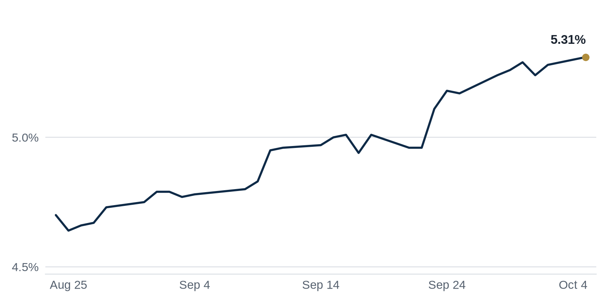

> **Review before publishing:**
> - check/long_sentence: 32 words: **Why it matters:** a large office trade gives...
> - check/long_sentence: 32 words: **Coffee chat line:** I'd point out that investors...
> - check/missing_link: https://commercialobserver.com/2026/10/ice-geo-immigration-california/
> - check/missing_link: https://www.trepp.com/trepptalk/four-las-vegas-casino-loans-lodging-cash-flow

## The Brief

- Rising interest rates are breaking commercial property deals as buyers and sellers cannot agree on price. [WSJ](https://news.google.com/rss/articles/CBMihAFBVV95cUxONXV6eW1EaHZGdUY3cmoxUEhXUUtzLUxBa25GbUt0Z2F6ZkxWUW9YQWZvY1NRcDk3ZzhZNmFXZ3JNTEp0LUJaOEFNVnp2TkR6NGFCeEVJMi02UXl6NS1kNWFHTlFQdjNfbnVKLVdSUHktbDMzSlZ4MGh0Ml95S2xncWFKem4?oc=5)
- Office loans bundled into bonds are going unpaid at a record pace, stressing landlords. [Wolf Street](https://news.google.com/rss/articles/CBMi6AFBVV95cUxQVEhLTTgyZy1qRWhJSnozTUI1MjJ6NXFaTlNfelZ1Tl9mUUJYZndrRXhBTjVfZXBOaTZSd0dGU3ZVSkJpWU5pLW5UVkhDbWNDQy0wUWhqTmltM3JWSnlScUFlaElGOGRDMmRtdC1ET3NfNUZZNnZOSWQ3LXZVbEtJS0hBc1d0d1pGenBhUmtZd3lxYzMyVTRKZUJ5MEVnNFdBWmJ0NENycVpodVNsWG54WU56anlwLW5FR1BlWm1SdFFYbmloRWp3SUJuNVJzU1lUcjQ1UVlTMWVxRHd4c2MxOC03ZnBPbnVo?oc=5)
- Investors are circling Los Angeles offices again now that prices have reset lower. [Yahoo Finance](https://news.google.com/rss/articles/CBMimAFBVV95cUxNcUhzamp3b0dqOUlId3FfMzBOd0RRdDN4VEhmQkRZeU55Q19NbTFadk5UQjFmYmQ1WWVmZDR6U2RWZU9jSU4tQVpJdWVqWmlLOE5EWlY1WU9fSV9PSGplenAtTnp4RjhvZ2RqclJ6ZFRsMDZsTl9PMFpPa2NBMlZvQ0FtQ0I2TlpKN1I2TExFT3lnQXRuQXU5RA?oc=5)

## The Numbers

*Rates as of Oct 5 close.*

- **10Y Treasury:** 5.31% (+3 bps)
- **5Y Treasury:** 5.06% (0 bps)
- **SOFR:** 3.89% (+1 bps)
- **Fed funds:** 3.75% to 4.00%
- **Next Fed meeting (Oct 28):** Polymarket's top outcome is No change 81.5%
- **REITs:** VNQ $89.15 (-0.4%). Best: UDR +1.7%. Worst: NNN -1.4%.
- **REIT yield vs. 10Y:** VNQ yields 3.60%, -171 bps vs. the 10Y.

**What it means:** Treasury yields barely moved, so commercial borrowing costs sit about where they were, but the 30-year mortgage rate jumped in its latest weekly reading. Today's levels are still high enough that buyers lean on bigger down payments and cautious loans. That keeps deal activity slow.

**Why UDR moved:** No company-specific news today; it may have moved with other apartment REITs.

**Why NNN REIT (NNN) moved:** No company-specific news today; it may have moved with other net-lease retail REITs.

## Debt Markets

Office loans bundled into bonds (commercial mortgage-backed securities, or CMBS) are going delinquent at a pace worse than the financial-crisis peak, Wolf Street reports. The long run of "extend-and-pretend" loan modifications is nearing its end. [Wolf Street](https://news.google.com/rss/articles/CBMi6AFBVV95cUxQVEhLTTgyZy1qRWhJSnozTUI1MjJ6NXFaTlNfelZ1Tl9mUUJYZndrRXhBTjVfZXBOaTZSd0dGU3ZVSkJpWU5pLW5UVkhDbWNDQy0wUWhqTmltM3JWSnlScUFlaElGOGRDMmRtdC1ET3NfNUZZNnZOSWQ3LXZVbEtJS0hBc1d0d1pGenBhUmtZd3lxYzMyVTRKZUJ5MEVnNFdBWmJ0NENycVpodVNsWG54WU56anlwLW5FR1BlWm1SdFFYbmloRWp3SUJuNVJzU1lUcjQ1UVlTMWVxRHd4c2MxOC03ZnBPbnVo?oc=5)

Apartment (multifamily) delinquencies remain elevated even as agency lenders like Fannie Mae and Freddie Mac expand their lending, GlobeSt reports. [GlobeSt.com](https://news.google.com/rss/articles/CBMipgFBVV95cUxOMWpMcmZHUTVnQXZ3WmR2UFFrMmtLWElKY29lbTd0ZHI0QkRQX0tYNXhWU1IwdUxGbXhWa09vbGs4U1ZSQ1lRWjFESE1LZHZJc2daRTFMUXlLZWVqQnRZYmZYdWNpNkhVdG9Ja2FYSlI0dzUtbU9zYkIwb2N4WV94dzFaSU1TVTlhcGxkX0lBN0ttbmhZQjliZkc0Z0ZmU3BBNW04V1NB?oc=5)

New York City faces a maturity wall, with $8.7 billion in loans due within 12 months, CRE Daily reports. A maturity wall is a cluster of loans coming due at once that borrowers must refinance or pay off. [CRE Daily](https://news.google.com/rss/articles/CBMijgFBVV95cUxQZlRfaURRN2I5UnM4bVpKV2pJR0tRLVkwTWs4Wkl3cjZzcVNpVTJ2VXRKVGVXQ1dIeko2S1BLX0VuZTFnTVJBcFE4a3ZGeDVYTmMzbjZhdnBXS1I2bHYySWM1TXktUUtZR0V1XzNfeWk4emgzYmJsd2FfQ1pUdktlRVgyc3pqVWpReF9zS05B?oc=5)

## Top Stories

### Rising rates are breaking CRE deals

A surge in interest rates is blowing up commercial real-estate deals, the WSJ reports. Higher rates raise borrowing costs, so buyers cut their offers while sellers refuse to budge, and transactions stall.
**Why it matters:** for a buyer using a loan, higher rates mean a property's income covers less debt, so they can only afford to pay less. Deals freeze until one side gives in. [WSJ](https://news.google.com/rss/articles/CBMihAFBVV95cUxONXV6eW1EaHZGdUY3cmoxUEhXUUtzLUxBa25GbUt0Z2F6ZkxWUW9YQWZvY1NRcDk3ZzhZNmFXZ3JNTEp0LUJaOEFNVnp2TkR6NGFCeEVJMi02UXl6NS1kNWFHTlFQdjNfbnVKLVdSUHktbDMzSlZ4MGh0Ml95S2xncWFKem4?oc=5)

### L&L buys Midtown East office for $245M

L&L Infinite closed on a Midtown East office purchase for $245 million, The Real Deal reports. The deal lands while Manhattan office values are still being tested.
**Why it matters:** a large office trade gives the market a fresh comp (a recent sale used to price similar buildings), showing buyers will still commit real money to New York offices. [The Real Deal](https://news.google.com/rss/articles/CBMilwFBVV95cUxNRUZCV21ZemluZEdCOFlBdGNvNGJjaWdMQm1QbE9NTlVSUDVmaHMyVjNmRXpOY3p2a0Q4Q0UwS0FGaUpSRjV1R01TZWdUQVFod1RqdlM2dkt3ZmNJb2dMT0VvVWdhZXJtb0hqZURCVlJmWTJEYTl1RGc5Ri1XM0lpVk1mWmtTQjB5eVhwTHRqWmNGdGlNWHlR?oc=5)

### Amazon's Chicago warehouse cost less than building it

Amazon bought a vertical Chicago warehouse for $195 million, less than it would cost to build one new, The Real Deal reports.
**Why it matters:** when buying beats building, developers have little reason to start new warehouses; that slows construction and, over time, can tighten space for tenants. [The Real Deal](https://news.google.com/rss/articles/CBMirgFBVV95cUxQRHhIbFp6bVFMZjZpaDd3N0owMnVuX2JqSHhMY1pvWno3WXEtWnRNTWVDZEFJSnFNbTNSNnhRUWoxVTNUY2JWc1NhTkdSNUVDOTF4bTZwSnB2X0FkNEFzS3FvdlpqLUtuQzlkWi1pQmlMMkpTaEg3R2dXbFBWdHRBanFJTF9IcGdwdFhfaDlNZFpsVXRkaE1TMXhrYnlBOUdnNVhLV0FPeE1SN1JwaEE?oc=5)

### Investors return to Los Angeles offices

Los Angeles commercial real estate is drawing investors as office prices reset lower, Yahoo Finance reports.
**Why it matters:** a price reset means values have fallen far enough that buyers see upside again; early movers are betting LA office has found its floor. [Yahoo Finance](https://news.google.com/rss/articles/CBMimAFBVV95cUxNcUhzamp3b0dqOUlId3FfMzBOd0RRdDN4VEhmQkRZeU55Q19NbTFadk5UQjFmYmQ1WWVmZDR6U2RWZU9jSU4tQVpJdWVqWmlLOE5EWlY1WU9fSV9PSGplenAtTnp4RjhvZ2RqclJ6ZFRsMDZsTl9PMFpPa2NBMlZvQ0FtQ0I2TlpKN1I2TExFT3lnQXRuQXU5RA?oc=5)

**Coffee chat line:** I'd point out that investors are circling Los Angeles offices again, which usually means prices have dropped far enough that the smart money thinks the worst is behind them. [Yahoo Finance](https://news.google.com/rss/articles/CBMimAFBVV95cUxNcUhzamp3b0dqOUlId3FfMzBOd0RRdDN4VEhmQkRZeU55Q19NbTFadk5UQjFmYmQ1WWVmZDR6U2RWZU9jSU4tQVpJdWVqWmlLOE5EWlY1WU9fSV9PSGplenAtTnp4RjhvZ2RqclJ6ZFRsMDZsTl9PMFpPa2NBMlZvQ0FtQ0I2TlpKN1I2TExFT3lnQXRuQXU5RA?oc=5)

## Market Watch

### Sun Belt

Blackstone sold warehouses in Dania Beach and apartments in Boynton Beach, part of South Florida's top deals this week, The Real Deal reports. Blackstone is one of the largest property owners in the world, so its selling tells you where a major investor thinks value has peaked. [The Real Deal](https://news.google.com/rss/articles/CBMikAFBVV95cUxNejdBZkRuclBrQVB4TXl0R3pyZlo5anJvM3htd2dEMjFFdnFIS0hTTmgyaHo0Y0Y5WTdseG9vTnk2RFBtdm9rT0pMdHE1d2ZmS1NHdmRRTk05ZDFXSkZGSGhnc1JLVGJ5SVhyNWRCcGhIZDZOMlVBTnk2X0ZBMWZNc1NaOEJiemFSLVdheFY3aVM?oc=5)
**Why it matters:** when a big seller trims warehouses and apartments in South Florida, it hints the easy price gains there may already be in the past.

## Quick Hits

- A downtown Seattle office tower was acquired for a fraction of its 2019 price, The Business Journals reports. [The Business Journals](https://news.google.com/rss/articles/CBMimAFBVV95cUxOMTlLNGpvRTFDejJQZ3N3WXBGWGFucjZ0eVRQcnBkdVA0T1ZwazROeFAyVXQ3SWF2REUzY2VpMnN5Z2o0YmtQUkJ6VVdhbWJ2anExLTRjS2ZvRVVSaG9SZE9PMG5IazNsNWp3U1FFdDYyN0hDb3E2RmQ3U2hHZkZxRFVma2dWdk9JbldKallQNS1FYjhrLS1DZQ?oc=5) A sale far below the old price shows how much downtown office values have dropped, giving the next buyer a much cheaper entry point.
- US real estate stocks hit an all-time low relative to the S&P 500, prompting Peter Schiff to warn the "industry is dead," TradingView reports. [TradingView](https://news.google.com/rss/articles/CBMi_gFBVV95cUxPLWtVaHYwbWJkSUNyaDAyOWh4dzFfT1p0S3dneC1HVnR0cnRjQ2RvdERwNktpNUdFSmRhY25zWGQ4Q3c0Z3JjLVlZZS1fYXl2cDhkUFVSRE54b0F2eE05RGdTZDJ1b2RHczRfS0pva3hCc3VmenN0QU9wNUdRZFozOHRqc2d3SVJSTVdoMDk3Wl8wWUFYZkIzMXFwRllRN2s1T2dtSnpZSzNvekhVWjFYUVN3X3VHTkxjUWRjUEp1NGpUUG5hLS1ONkpDZWVualp5cjhNZ1YwTDNmWENDU1RKNl9YZ0hoVWF1dnBmOG1yem9BakFkSXJpZXBCM1FLQQ?oc=5) Investors are dumping property stocks faster than the broad market, a sign Wall Street doubts a quick recovery.
- Multifamily's days as commercial real estate's "golden child" are over as high borrowing costs and oversupply weigh on apartments, Bisnow reports. [Bisnow](https://www.bisnow.com/news/national/capital-markets/multifamilys-days-as-commercial-real-estate-golden-child-are-over) Too many new units plus expensive loans mean apartment owners can no longer count on easy rent growth.

## Term of the Day

**Extend and pretend:** when a lender pushes back a loan's due date instead of foreclosing, hoping the building's value or income recovers before the new deadline. It avoids taking a loss today, but if the property keeps struggling, the problem just shows up later. That is a big reason office loan troubles have dragged on for years, as today's Debt Markets section shows.

For informational purposes only. Not investment advice.
