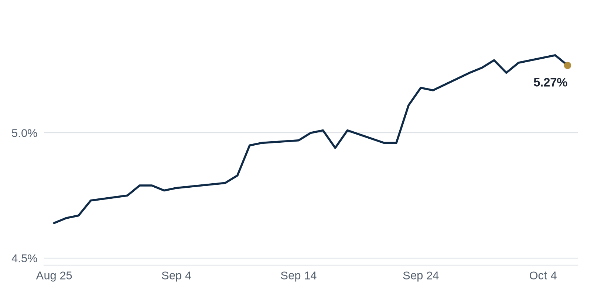

> **Review before publishing:**
> - feed/REBusiness Online: ReadTimeout: The read operation timed out
> - reits: prices from Alpha Vantage only, not cross-checked (no second source; set TIINGO_API_KEY)
> - reits: AVB quote is stale (2026-08-17)
> - check/long_sentence: 34 words: **Why it matters:** a $1 billion bet on...
> - check/long_sentence: 44 words: With the 10-year Treasury yield above 5 percent,...
> - check/long_sentence: 39 words: **Why it matters:** a seasoned operator committing a...
> - check/long_sentence: 31 words: Los Angeles County tenants signed about 4 million...
> - check/long_sentence: 32 words: **Why it matters:** steady leasing means landlords can...
> - check/missing_link: https://news.google.com/rss/articles/CBMilwFBVV95cUxOT0lITVpDQ0RLemtGUDRSRUNvcjdXVURKT3FvOGFDenpoeW5IOUFKZERUMDJkU2JDYVZyTkZaTzZQU0ZaR3JxempGdVJNTHpQa1FBaUlkdGE1ZVkzdWtTMmVkY183bWlod05xYURBLURyZ1UyTi1EbVJaMjlQYzRuNDdpRmRIV3lsc21scjVNUjhuZDJnZXFr?oc=5
> - check/unsourced_number: Top Stories: 5 percent
> - check/unsourced_number: Quick Hits: 5.8 percent
> - check/contradiction: Top Stories: says "**Why it matters:** when yields rise, a REIT's stock falls," but VNQ is up today

## The Brief

- High Treasury yields are freezing large REIT mergers, leaving buyers and sellers unable to agree on price [Bisnow](https://www.bisnow.com/news/national/capital-markets/-put-on-pause-soaring-yields-stall-reit-m-a-for-now)
- Tishman Speyer signed a long ground lease to take over and renovate Manhattan's landmark Chrysler Building [Commercial Observer](https://commercialobserver.com/2026/10/tishman-speyer-ground-lease-signed-chrysler-building/)
- CMBS delinquencies, late payments on bundled property loans, climbed to their highest level in years, pressuring lenders [Scotsman Guide](https://news.google.com/rss/articles/CBMijgFBVV95cUxPRFNIdTZyYmJfdVBfU3V4d0h1cGNUSmY2TXloWlB4UW1taS16SExqaHJ2WF8tanRQMnZOdW5yZUNVN3UyM3EzNXBBTHBEakhEWHZnbm5MR25JUFJtdm0zWllmMjJHRjFSMHhQWWEwbGh3TUVnMlhkVG9tS3NudFNwSi1JUWo0bmRmREM2cU9n?oc=5)

## The Numbers

*Rates as of Oct 6 close.*

- **10Y Treasury:** 5.27% (-4 bps)
- **5Y Treasury:** 5.03% (-3 bps)
- **SOFR:** 3.90% (+1 bps)
- **Fed funds:** 3.75% to 4.00%
- **Next Fed meeting (Oct 28):** Polymarket's top outcome is No change 82.5%
- **REITs:** VNQ $89.93 (+0.9%). Best: DLR +2.7%. Worst: STAG +0.2%.
- **REIT yield vs. 10Y:** VNQ yields 3.60%, -167 bps vs. the 10Y.

**What it means:** Treasury yields held roughly steady, but the 30-year mortgage rate jumped, which raises borrowing costs for anyone trying to finance or refinance property this month.

**Why Digital Realty (DLR) moved:** No company-specific news today; it may have moved with other data center REITs.

**Why STAG Industrial (STAG) moved:** No company-specific news today; it may have moved with other warehouse REITs.

## Debt Markets

CMBS delinquencies have reached their highest level since 2020, according to [Scotsman Guide](https://news.google.com/rss/articles/CBMijgFBVV95cUxPRFNIdTZyYmJfdVBfU3V4d0h1cGNUSmY2TXloWlB4UW1taS16SExqaHJ2WF8tanRQMnZOdW5yZUNVN3UyM3EzNXBBTHBEakhEWHZnbm5MR25JUFJtdm0zWllmMjJHRjFSMHhQWWEwbGh3TUVnMlhkVG9tS3NudFNwSi1JUWo0bmRmREM2cU9n?oc=5). CMBS are bonds backed by pools of commercial mortgages, so rising late payments tell investors that more landlords are struggling to keep current.

Trepp reports that October's private-label CMBS hard maturity cohort totals $4.70 billion across 144 loan pieces, up from September's $2.74 billion. Most of the severely impaired balance sits in two large single-asset loans, a national multifamily portfolio and a Honolulu resort, per [Trepp](https://www.trepp.com/trepptalk/october-2026-cmbs-hard-maturities-refinancing-risk). A hard maturity means the loan is due and must be paid off or refinanced now.

Higher rates are pushing CRE buyers to reopen deals they already agreed to, just as a wave of loans comes due, says [GlobeSt.com](https://news.google.com/rss/articles/CBMiqgFBVV95cUxPZkN1STI3b2lfVjFqdlpnUEpvWmF6MWJ6UWE2UGVXUG1yNlBNb3lIeF83WWc3YjFCdV9iTy1FWXBhWDNwS05peDRYYVZwZm9qVlRMZTF3N2Q3WUFJZ1JjT0FkSHh1djVYT0RtaUUteXNJQUJzV1ZtNE04bTltQjF0THZxdWoyalFJUGZZOGtRdkg3T2VNZFk2V0NZekZZb3pSaDlhTURLNDBKQQ?oc=5). JPMorgan's Jamie Dimon has also warned that interest rates could keep rising, per [GlobeSt.com](https://news.google.com/rss/articles/CBMilgFBVV95cUxQRWZ1WUVVbERNUmdkeFY3UW5vYnVLQXgxVjFGc2JONlhiUVhINjlNYWtaSTk2QmJIVzVadnA3ZElwU09uOENQSE9UT2Z5SHZndGhERm5wOU5EeHNnbWxXdG5IbDdiUUNDX3VFV0dGcjJUWDFSNkd5WnZmQTBYa2dmc2NvV2x3cHRtSGw0N1hsSkVWenlCMkE?oc=5).

**Distress Watch:** A new report says flagged commercial real estate loans in Texas topped $1 billion in October, per [The Real Deal](https://news.google.com/rss/articles/CBMijAFBVV95cUxPU1BuZElUTkhlY1FMeTliQ1hab1BLeG5jZFl1and5dHhFYjYyRjNUcG9MUUczNEt5OHdsQ0xOWTFVT3VJVXRtMWJXWm8tb1NReGl4dDZ3RWtSeXBtR2VlUXdDZVlacTRmVEgwU3BpOU5aMkRfZklrZWpuVk9rN2k3S3lFTjMzaG5nbmxRWA?oc=5).

## Top Stories

### BDT & MSD Partners Buy Sunrise Senior Living

BDT & MSD Partners agreed to buy Sunrise Senior Living at a $1 billion valuation. The deal puts a large senior-housing operator under new ownership.

**Why it matters:** a $1 billion bet on senior housing signals that patient buyers see demand from an aging population as durable, even while higher rates make most other large deals hard to pencil. [The Real Deal](https://news.google.com/rss/articles/CBMioAFBVV95cUxQTTRmU2p4MUZQUElINjdfbk5hd2dOTDIyaWZkOC1uM0tFLXM5LWVOTFhONE9mSUZ4b3lMMnJOdk81UExFNUFveHFSNXpsMzdRSzVCMkhMajBVR2hza3BrWmxGRmUxMWwwOXhja3ZGallGVFZnbm1hMndWRVQwNXJqdG44NzZyb010NVpCTTdsUXpHX3ZuemNZTXVCUEFyU0di?oc=5)

### Soaring Yields Strand REITs in M&A No-Man's-Land

With the 10-year Treasury yield above 5 percent, REITs are being repriced in real time, and large mergers have been "put on pause." A REIT is a company that owns income property and trades like a stock, so its share price moves with rates.

**Why it matters:** when yields rise, a REIT's stock falls, making its shares a weaker currency for acquisitions, so sellers who want yesterday's price have no buyers today. [Bisnow](https://www.bisnow.com/news/national/capital-markets/-put-on-pause-soaring-yields-stall-reit-m-a-for-now)

### Tishman Speyer Takes Over the Chrysler Building

Tishman Speyer signed a 150-year ground lease with Cooper Union, the college that owns the land under the Chrysler Building, and plans to renovate the landmark tower. A ground lease means Tishman controls and operates the building while Cooper Union keeps the dirt beneath it.

**Why it matters:** a seasoned operator committing a century and a half to an aging Midtown trophy is a vote of confidence in New York office, giving nearby landlords a comp to point to when they lease or refinance. [Commercial Observer](https://commercialobserver.com/2026/10/tishman-speyer-ground-lease-signed-chrysler-building/)

### L.A. Office Leasing Hits Highest Level Since 2019

Los Angeles County tenants signed about 4 million square feet of office leases in the third quarter, up 15 percent from a year ago and 0.7 percent from the second quarter. It was the market's strongest quarter since 2019.

**Why it matters:** steady leasing means landlords can fill empty floors and support their rents, which lenders need to see before they will refinance the office loans coming due across the county. [Commercial Observer](https://commercialobserver.com/2026/10/l-a-office-leasing-hits-highest-level-since-2019/)

**Coffee chat talking points:**

- L.A. tenants signed about 4 million square feet of office leases last quarter, so the coastal office recovery reaches past San Francisco's AI boom. [Commercial Observer](https://commercialobserver.com/2026/10/l-a-office-leasing-hits-highest-level-since-2019/)
- With flagged Texas CRE loans topping $1 billion in October, it is easy to see why REITs are pausing big deals until rates settle. [The Real Deal](https://news.google.com/rss/articles/CBMijAFBVV95cUxPU1BuZElUTkhlY1FMeTliQ1hab1BLeG5jZFl1and5dHhFYjYyRjNUcG9MUUczNEt5OHdsQ0xOWTFVT3VJVXRtMWJXWm8tb1NReGl4dDZ3RWtSeXBtR2VlUXdDZVlacTRmVEgwU3BpOU5aMkRfZklrZWpuVk9rN2k3S3lFTjMzaG5nbmxRWA?oc=5)

## Market Watch

### Sun Belt

Office rents in one Uptown district were already climbing fast. Then Morgan Stanley announced plans for a new hub there, adding fresh demand to an already tight market, according to [The Business Journals](https://news.google.com/rss/articles/CBMiqgFBVV95cUxQS0kzMjFtOHdKVFNoN3NPby0zQzZOWFJsVVBDUkxVY1F3dEFzeTdSdTFpdlRuQlJuNzhVVGFPZ2ppbW9SWlpDOXdtdXB2ZFlZbzJZaERpNUxVcnhPX05hVnk4ZFIyWkpGUWJSOUhOVXNfbVhiWEcxZWg2YW01cmdObVNEUXVNaHhDcE5qX3h4Z2VtRFlsemk0dlFsYkVLYi1FLUZLbWF3bEVQdw?oc=5).

**Why it matters:** when a major employer commits to a market, local landlords gain leverage to raise rents, and existing tenants may pay more at renewal.

### West Coast

A San Francisco landlord is suing its current tenant, robotics firm Physical Intelligence, to clear space for AI company Anthropic. The dispute shows how hard AI firms are competing for prime city office space, per [The San Francisco Standard](https://news.google.com/rss/articles/CBMiigFBVV95cUxPc1dsSzVldkd5TXlTZ0I4Q3FPTnBnaHFXVDRxbXVaNm5Qb0YwMnJvMmFnTDUwZWFNZFA3Rlh1T2NCQldralZhNmdEYi1vamtyTmVYTlV3U2FPdlNsNnVob2wzUFcxQkhEVHpfVEJhTWhPWWQ1aHFzWHZaWEpUUE1NYzF2cWNyaE5MbHc?oc=5).

**Why it matters:** fierce AI demand for offices gives San Francisco landlords the upper hand, reversing years of empty towers and weak rents downtown.

### International

CPPIB and Temasek, two large institutional investors, helped push Nuveen's Australia private debt strategy past $679 million. The fund lends against Australian commercial property rather than buying it outright, reports [Mingtiandi](https://news.google.com/rss/articles/CBMiqwFBVV95cUxQaF8xdVVIRVFXMXZtQURLQUtzQ1k5bmZyUDBhZWFuTTNYLTYzOGNzN3NvWXp6bjdsdENYcGN0OHVqUnFNTUtDYVR6S3BNbE4yeTFtdE4ybWFOaVA1Z0hEdVhnbXg1QjI0WTJHU0tvTllVNXdoRjFxYnZlZ182bXBzWnd4Y1FpWEIxdVliOUxrRC11WW5xVEhnU0RHX0lKRWxEMGswOXZNVW1DZFk?oc=5).

**Why it matters:** as banks pull back, big investors stepping in as private lenders means borrowers still have somewhere to turn, but often at a higher price.

## Quick Hits

- Edwards Realty Co. paid $30 million for Block 37, a 278,000-square-foot vertical mall in downtown Chicago, per [Bisnow](https://www.bisnow.com/news/chicago/retail/edwards-realty-company-acquires-block-37). Buying a troubled property at a steep discount lets a local owner try to fix it up and fill it, something the prior owner could not do.
- Erez Asset Management now owns 5.8 percent of Empire State Realty Trust, the REIT that owns the Empire State Building, reports [Bisnow](https://www.bisnow.com/news/new-york/office/activist-investor-erez-asset-management-empire-state-realty-trust). An activist investor buys a stake to push management for changes, which can shake up how a landlord runs its buildings.
- San Francisco's office market has leased 12.1 million square feet so far in 2026, driven by artificial intelligence firms, according to [Bisnow](https://www.bisnow.com/news/san-francisco/office/ai-surge-driving-sf-office-market-leasing-to-strong-totals-in-decades). Heavy leasing from one booming industry can revive a downtown, though it leaves the market exposed if that industry cools.
- Yardi expects apartment values to stay under pressure through 2027, per [GlobeSt.com](https://news.google.com/rss/articles/CBMilgFBVV95cUxOcWFiUUtqQlU4c1RKWHJGQWo1OUtXY1pMc0VSdDZocVlmNFJXSV9RbzREbnZnVVVfRE52TV90QU1qRzRLTnFlelhHbng5djZaLWEwOVF1UlNVOTI4Qm9FSDRHZldqWXdPVXczX2VpMXFrSnRhR3RTbDdWcHJJT3lFR3lYd2ozM3FIRC1FWlRnanZxVGFGWlE?oc=5). Falling values hurt owners who want to sell or refinance, because the building is worth less than they paid.
- The Real Deal looks at why New York's new-development market has suddenly slowed, calling the swoon a "head-scratcher," per [The Real Deal](https://news.google.com/rss/articles/CBMimgFBVV95cUxPaWNHN1ZfWnJkMjhRNmNnVmNFLVdFejNlR2JmVWpqNTROV1Z5SmJZT3pOM1FvblpKa0dHUUJGMW5RV1VYNlgtVlgtVXJIRzBCSjIwLWRwVGEtMlNZR3A4dV9lemxSRW1lM2daal9UZWk1a0NwandKVTQtOXJ4RmJDTURBX0NtMnlUcmRubWpLTzVPcGFTWXAtMzl3?oc=5). When buyers of new condos pull back, developers slow new projects, which eventually tightens future supply.
- Two Fortune 500 energy companies are relocating from Oklahoma to Houston, reports [The Real Deal](https://news.google.com/rss/articles/CBMingFBVV95cUxOZFoweDFCZXllcjlNX0daRzJDWGJjVXdoM2VHTzh0eGs4WHZHQmJuM01DNVplRlZjcGVJRC1TVTRkN3UxREhWSzdyTjhrb0s1Rld0d0dSRlZiS2VYTmZpTDI3LVpEcFlNY0VVcklSMFVuTmlyR3ltVWNpQ01zSF9wekVLSTh5MGh4Qk5Wc0FfalJLYWtMaHRDakVFemxwQQ?oc=5). Corporate moves bring jobs and office demand to the winning city and leave empty space behind in the one they left.

## Term of the Day

**CAM (common area maintenance):** a tenant's share of the cost to run shared spaces like lobbies, parking lots and landscaping. On a typical lease, a tenant renting 10 percent of a building pays about 10 percent of these bills on top of base rent. Landlords recover upkeep costs this way; tenants should read CAM terms closely.

For informational purposes only. Not investment advice.
