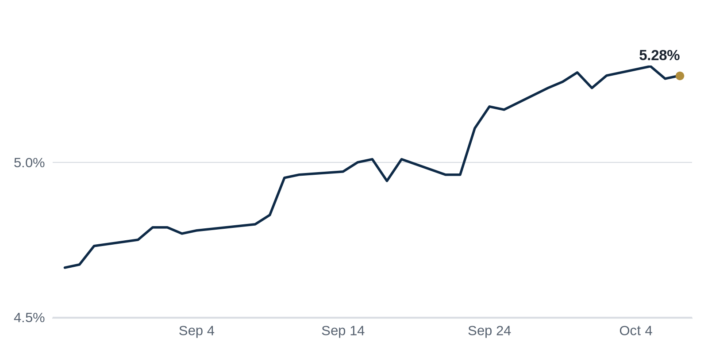

> **Review before publishing:**
> - reits: prices from Alpha Vantage only, not cross-checked (no second source; set TIINGO_API_KEY)
> - editor: fixed: The Tishman Speyer Chrysler Building story was a Brief bullet and a full Top Story in the previous issue; repeating it as a Quick Hit is a repeat.
> - check/long_sentence: 34 words: It was already close; the only changes I...
> - check/long_sentence: 48 words: Everything checks out: no stray market figures, placeholders...
> - check/long_sentence: 31 words: **What it means:** Treasury yields barely moved, but...
> - check/long_sentence: 35 words: **Why it matters:** Owners delaying a reckoning keep...
> - check/long_sentence: 35 words: **Distress Watch:** Bisnow reports that strong top-tier malls...
> - check/long_sentence: 31 words: SL Green and Mori Trust still lined up...
> - check/missing_link: https://news.google.com/rss/articles/CBMimAFBVV95cUxQb1kzTEhhQU12cnNBYU1na3NsSkNjR1d5cm9GUl9ObXFZNnJuanUyN2NrdDQtNGVlOHEya0JqZFBVZkVTdmpQOEVCdUdlYkFMZWlncEoyMi14UzJXdnVMNFhKM21CZTdWN0hEbVFzTWM4TmhkTjU4clhCTk1MSlIyU1hVbFJNTGdJU0ZuTFVJazQ0c01ydVJJWg?oc=5
> - check/missing_link: https://news.google.com/rss/articles/CBMilwFBVV95cUxOT0lITVpDQ0RLemtGUDRSRUNvcjdXVURKT3FvOGFDenpoeW5IOUFKZERUMDJkU2JDYVZyTkZaTzZQU0ZaR3JxempGdVJNTHpQa1FBaUlkdGE1ZVkzdWtTMmVkY183bWlod05xYURBLURyZ1UyTi1EbVJaMjlQYzRuNDdpRmRIV3lsc21scjVNUjhuZDJnZXFr?oc=5
> - check/missing_link: https://news.google.com/rss/articles/CBMiqgFBVV95cUxPb3RXTWVzVndYMkpTSGFsb0IwRlk1R1B6TlJ3ekxaZXY5emVONGxGQ3I4Y2VPSmYwX2owSmt5V3ExNTM2YmlZaDA1dl9rQ1lSUWFnb1RUWW05RlJtaGx4RW1ZVWNvNk1EaEx4b3ZkNDBuVlRod2tuN2NaTUUzWGRQZEVJOVpoaUdMM3FlU1lqQWlzNmNBVHNIWUJpc0tFbFVwMFE2aFdwVThXdw?oc=5

## The Brief

- Rising borrowing costs are squeezing deals, making it harder for buyers and sellers to agree on price. [WSJ](https://news.google.com/rss/articles/CBMipAFBVV95cUxNNTVxOXlhdno1TzZaZ0dXWm1CdVVJa29SVUNFb0Y1Yk1zQTRGcmJYMC11NnpYUTMyVFdOSl82ZzVLaXNPTWdNMXhlcGJuMjM3MHd1dVU0NjhxRHZMRWdOZkUzakhkZFM5bmtxMVdfM2h4X2djOUVwRzZQLXRwbm1iMEtmWU5TTEZJcUtTS2I5WmE3RkJnZXZTanVzSWUtdUFPLUhoNg?oc=5)
- Houston plans to sell two downtown office towers, a move the city calls skyline-redefining. [Houston Chronicle](https://news.google.com/rss/articles/CBMiqgFBVV95cUxOdm1WQktsNktuZU9pelBVOGJxOGwyRXNXTTQ4VkR5b0RqSlgwV01OSWJZU2R6SkNGTmJNeEdlb2M4ZVhrYXAzdWlHdUJpTzl4a09hN3MwdUZKbURaWmxaNm1Ka3hyeVJxWmF0ZkMtRExncTR1TFA4Q2JmV0NuMXJhN0M4T29RcEVoX2RMQUdkRGhfSTRtUWFQeHo2RGFzeFN2aG5CRjRNM3RoUQ?oc=5)
- Amazon is walking away from a large chunk of its Boston Seaport offices, leaving space to fill. [The Real Deal](https://news.google.com/rss/articles/CBMirAFBVV95cUxPa2FWTnRJS1l2YVNHc2xTUFBxdzYzcm1hWDVVeXhLeDZRMlJTY2hpaGZ4TG1vNFBWMDFGTUpYckNJOGZSdjYtbmpKcm8weHB2UTFWTEd2UlZ1amw0RWRtaHFYZFQweTVNUU82UGJMUVJMYnppb01fNzh6cFJEVzdzN01GbWEzWEtHcmJ1YlplcmNOdzBTOXFfa2d1U2hGSEtQajlySVNMb3ExTmQ2?oc=5)

## The Numbers

*Rates as of Oct 7 close.*

- **10Y Treasury:** 5.28% (+1 bps)
- **5Y Treasury:** 5.03% (0 bps)
- **SOFR:** 3.88% (-2 bps)
- **Fed funds:** 3.75% to 4.00%
- **Next Fed meeting (Oct 28):** Polymarket's top outcome is No change 83.5%
- **REITs:** VNQ $88.69 (-1.4%). Best: VICI -0.4%. Worst: MAA -2.4%.
- **REIT yield vs. 10Y:** VNQ yields 3.60%, -168 bps vs. the 10Y.

**What it means:** Treasury yields barely moved, but the 30-year mortgage rate jumped, so anyone buying a home or refinancing one now faces a bigger monthly payment than a week ago.

**Why VICI Properties (VICI) moved:** No company-specific news today; it may have moved with other casino REITs.

**Why Mid-America Apartment (MAA) moved:** No company-specific news today; it may have moved with other apartment REITs.

## Debt Markets

SL Green and Mori Trust lined up a $2bn CMBS refinancing for New York's 245 Park Avenue. A CMBS loan is one a lender bundles with other loans and sells to bond investors. Landing one this size shows bond buyers still want to fund a top Manhattan office tower. [PERE](https://news.google.com/rss/articles/CBMiwwFBVV95cUxONG5JVDFRN240azAwZTFmRUEyWERDLVpFOUNGYjduR09sbjZjb2xIYVdKVzE5eWN2UE92eDhsVWJBS0VhSFRSZlRLYjFKMUhBWE5JTFNfTDZKR09xWTFPNUh1RE9EYndHRVlVVEY2elBUa3luTEtnY0tlSnJhU3VMRFRoWXdBNWlhMzlnVXhVX3l2TEs5dmhwd3pFMHctRkZ2dkhnMEk0V0VjMDFRcjJubHZWUDVmTFJFc0NIUHd6S01GV1U?oc=5)
**Why it matters:** a clean refinancing on a trophy tower gives owners of lesser buildings a benchmark, but one only the best assets may reach.

GlobeSt reports that office CMBS lending is spreading beyond trophy towers to more ordinary buildings. For two years lenders stuck to the safest, highest-quality offices. A wider appetite means more owners can refinance maturing debt. [GlobeSt.com](https://news.google.com/rss/articles/CBMikAFBVV95cUxNZVVYWWQtbGhSSzk2TTh3TlN0WjcyNUVTUGVFemNVUmpoamJKRTlBTWtkMXFtY1pWOUFJejhQZUZLTGtGXy01VlZGLWwwUHV1SEZnZlJnSnlPUk13MVh6S0dtWWtwRGxNa3dZYjBDd3dnb0RELXV2TVJMOEpHblhfZDZob1pYNFFUNVdqQzB4UEI?oc=5)
**Why it matters:** if lenders fund more than just the best offices, owners of mid-tier buildings have a better shot at refinancing instead of defaulting.

The CREFC sentiment index, a survey of commercial real estate finance pros, fell 17.5% to a three-year low. The drop signals that lenders and investors feel worse about the months ahead. [CRE Daily](https://news.google.com/rss/articles/CBMiiwFBVV95cUxNWFFxV256NnZhYm50dzRqcTFINy1iRF9XbzZmeDc5bm80My1iT1Ruc2VvQmltRGN3ZXg2Q28xTzdPTGpUV1o3MjQyR0lBVVdPaE1jbmdvTGVVY2pSbk56WEdPMDR0UXpWcDBzREtndi01akhyMVh3WjZXUk95LTR5THQ1ZTEwU29TU1F3?oc=5)
**Why it matters:** when the people who make loans turn gloomy, credit gets tighter and pricier for every borrower.

A bridge loan is short-term debt that an owner takes while arranging permanent financing. Owners facing maturing loans are stacking one bridge loan onto another to postpone a sale or refinancing they cannot afford today. The bet buys time, but it gets riskier as borrowing costs climb. [Bisnow](https://www.bisnow.com/news/national/capital-markets/bridge-to-bridge-bet-holding-off-cre-day-of-reckoning)

**Why it matters:** Owners delaying a reckoning keep troubled properties off the market, so lenders and buyers waiting for cheap distressed deals may keep waiting, while owners risk owing even more if rates stay high.

**Distress Watch:** Bisnow reports that strong top-tier malls are masking deep trouble underneath, with Green Street finding mall values up 13% but most of that gain concentrated in Class-A malls while hundreds of others struggle. [Bisnow](https://www.bisnow.com/news/national/retail/top-tier-malls-mask-enduring-distress)

## Top Stories

### Houston lists two downtown office towers for sale

Houston is putting two downtown office towers on the market in what it calls a skyline-redefining move. The sale would change hands for prominent buildings during a weak stretch for office demand. [Houston Chronicle](https://news.google.com/rss/articles/CBMiqgFBVV95cUxOdm1WQktsNktuZU9pelBVOGJxOGwyRXNXTTQ4VkR5b0RqSlgwV01OSWJZU2R6SkNGTmJNeEdlb2M4ZVhrYXAzdWlHdUJpTzl4a09hN3MwdUZKbURaWmxaNm1Ka3hyeVJxWmF0ZkMtRExncTR1TFA4Q2JmV0NuMXJhN0M4T29RcEVoX2RMQUdkRGhfSTRtUWFQeHo2RGFzeFN2aG5CRjRNM3RoUQ?oc=5)
**Why it matters:** a public sale sets a fresh price for downtown office that buyers and lenders will treat as a comp for the rest of the market.

### Higher financing costs are stalling deals

The Wall Street Journal reports that climbing borrowing costs are threatening commercial real estate transactions. When debt gets more expensive, the price a buyer can pay falls, so buyers and sellers struggle to meet in the middle. [WSJ](https://news.google.com/rss/articles/CBMipAFBVV95cUxNNTVxOXlhdno1TzZaZ0dXWm1CdVVJa29SVUNFb0Y1Yk1zQTRGcmJYMC11NnpYUTMyVFdOSl82ZzVLaXNPTWdNMXhlcGJuMjM3MHd1dVU0NjhxRHZMRWdOZkUzakhkZFM5bmtxMVdfM2h4X2djOUVwRzZQLXRwbm1iMEtmWU5TTEZJcUtTS2I5WmE3RkJnZXZTanVzSWUtdUFPLUhoNg?oc=5)
**Why it matters:** fewer deals close when financing costs rise, and sellers who must transact may have to cut prices to find a buyer.

### A September rate hike reshapes New York multifamily math

Investors spent two years waiting for lower rates. Instead the Federal Reserve raised its benchmark again in September, lifting the cost of floating-rate debt, and Commercial Observer says that changes how New York apartment deals pencil out. [Commercial Observer](https://commercialobserver.com/2026/10/interest-rate-hike-new-york-city-multifamily-investing/)
**Why it matters:** higher rates mean bigger loan payments on apartment buildings, so owners refinancing maturing debt may need to add cash or sell.

### Green Street warns prices could fall further

Property data firm Green Street says commercial real estate prices have stalled and may decline more, according to GlobeSt. Green Street tracks values across property types and is closely watched by investors. [GlobeSt.com](https://news.google.com/rss/articles/CBMirwFBVV95cUxNdzVuNDVDa2pxbjBKVE5kUm5QM2NIOFpzV1U2UXVpX2w4YnpHMjAxclJ4QkxnQmdyN01lN19Yem1rajJlLTM3LW9LM3ZvcGlCdmhqSmZ4U2ZYRHVfamFHMmVBWWFxQ05nR1JJUzVORDg2aHJ4NVViZ2pBa0dwRUp5Q3VvN0h2ejNRX0xfck9QOGZFOTBYcTJnX25QaF9aVWtJT1JNQ2d2SFpreUZXdHlB?oc=5)
**Why it matters:** falling values shrink owners' equity and make refinancing harder, and lenders grow cautious when the collateral behind their loans is worth less.

### Amazon pulls back from Boston's Seaport

Amazon is abandoning a significant chunk of office space in a Boston Seaport building, The Real Deal reports. The move adds empty space to a high-profile waterfront district. [The Real Deal](https://news.google.com/rss/articles/CBMirAFBVV95cUxPa2FWTnRJS1l2YVNHc2xTUFBxdzYzcm1hWDVVeXhLeDZRMlJTY2hpaGZ4TG1vNFBWMDFGTUpYckNJOGZSdjYtbmpKcm8weHB2UTFWTEd2UlZ1amw0RWRtaHFYZFQweTVNUU82UGJMUVJMYnppb01fNzh6cFJEVzdzN01GbWEzWEtHcmJ1YlplcmNOdzBTOXFfa2d1U2hGSEtQajlySVNMb3ExTmQ2?oc=5)
**Why it matters:** when a major tenant leaves, the landlord loses rent and must backfill the space, and more vacancy pressures rents across the submarket.

**Coffee chat talking points:**

- The CREFC lender sentiment index just fell 17.5% to a three-year low, the gloom you would expect while higher financing costs freeze deals. [CRE Daily](https://news.google.com/rss/articles/CBMiiwFBVV95cUxNWFFxV256NnZhYm50dzRqcTFINy1iRF9XbzZmeDc5bm80My1iT1Ruc2VvQmltRGN3ZXg2Q28xTzdPTGpUV1o3MjQyR0lBVVdPaE1jbmdvTGVVY2pSbk56WEdPMDR0UXpWcDBzREtndi01akhyMVh3WjZXUk95LTR5THQ1ZTEwU29TU1F3?oc=5)
- SL Green and Mori Trust still lined up a $2bn CMBS refinancing for 245 Park Avenue, so trophy New York office can clear the debt markets even while weaker buildings cannot. [PERE](https://news.google.com/rss/articles/CBMiwwFBVV95cUxONG5JVDFRN240azAwZTFmRUEyWERDLVpFOUNGYjduR09sbjZjb2xIYVdKVzE5eWN2UE92eDhsVWJBS0VhSFRSZlRLYjFKMUhBWE5JTFNfTDZKR09xWTFPNUh1RE9EYndHRVlVVEY2elBUa3luTEtnY0tlSnJhU3VMRFRoWXdBNWlhMzlnVXhVX3l2TEs5dmhwd3pFMHctRkZ2dkhnMEk0V0VjMDFRcjJubHZWUDVmTFJFc0NIUHd6S01GV1U?oc=5)
- Brookfield paid $205M for a San Jose student housing tower, a sign buyers will still pay up for housing with steady demand even as office values stall. [The Real Deal](https://news.google.com/rss/articles/CBMiqgFBVV95cUxPLXdNdlMzdXNhUTF4dHhLM0poNmY1WVYtajRnUU1zcWlsRUpOenlJYWhVQWhWRDgtVHpob196NlVfLWprVUllMUpOWkJWV045bVdzaHVZTHljQ1VuU1dRYnowMVJhYzg3bklXQzE1aHBjNmllTFJNWkQ2ZnJISTJ2aXlxdXBKRTNjdWgwNHhoTGJKcGxYNl9oNUpOZ2dWV1cxOS1rQUgxU2J6Zw?oc=5)

## Market Watch

### Sun Belt

An Atlanta developer is entering Central Ohio with a 1 million-square-foot project near Rickenbacker, The Business Journals reports. Rickenbacker is a cargo airport hub that has drawn warehouse builders chasing shipping demand. [The Business Journals](https://news.google.com/rss/articles/CBMipgFBVV95cUxONFFsblR0NE1ZMUtfcGE4eGVoLWdCUWxjQVpsUlM0X1FoWHotTEktWklZN1ZFT3hoN25jdUYtUTNGd0xSNTF6a2RmWTU4a3A4WUxDa0FIMDNlQ2VJWEZ1dmlFUDhvVXotYVlNMjZaTExwOFRrX3dJbFd1RzBOMEZtaGQ1T1AzbFlXdDU3SFU5ZW9KenQ5WHB5Q3dSbG1mTDlmbmpFZnhB?oc=5)
**Why it matters:** a big new warehouse signals the developer bets online shipping will keep filling space near freight hubs, which can lift land values nearby.

### West Coast

Brookfield and Coastal Ridge bought a San Jose student housing tower for $205M, according to The Real Deal. Student housing rents off university enrollment rather than the office cycle, so its demand tends to hold steady. [The Real Deal](https://news.google.com/rss/articles/CBMiqgFBVV95cUxPLXdNdlMzdXNhUTF4dHhLM0poNmY1WVYtajRnUU1zcWlsRUpOenlJYWhVQWhWRDgtVHpob196NlVfLWprVUllMUpOWkJWV045bVdzaHVZTHljQ1VuU1dRYnowMVJhYzg3bklXQzE1aHBjNmllTFJNWkQ2ZnJISTJ2aXlxdXBKRTNjdWgwNHhoTGJKcGxYNl9oNUpOZ2dWV1cxOS1rQUgxU2J6Zw?oc=5)
**Why it matters:** a large buyer paying up for student housing shows investors want property with reliable income when offices look shaky.

### International

Colliers says Canada's office market has reached what it calls the great stabilization, while the industrial sector is set to power the next phase of growth. The report frames offices as steadying after a rough run. [PR Newswire Canada](https://news.google.com/rss/articles/CBMilwJBVV95cUxPQklTczk3MUpTMEtJX0ZoUzVrdExLY3c2UXFWTVJQSjdHQTJDWE1Td1RDOUZDT2xSQWVMdU9WS0xYTlo5RThxSEpEdF9KU0pkai1EZVNQYzRBbXlnbXdLQlRnTm02WmNITzFrZ1AzNnpQVVRyblczSURXaHFBTXFna2tNa2R6RVA3ZWhWNVFqRU1xenhhZTlrV2RqV3QxcHdsMldfZjBCLWpKaUJNV2ZDRzlpZTZvQ0J1UE5xMFdDR1d6WjhTckR2dXRpRksxQ1pyZ1ltRkRLaVFQWWt2M05zWHFTWHphcXBqWUoydlI3WE1nYXMyUVllcDVBSlFOTWp4WlJBd0JPdXdtR2xWXy1Od1ZKaTFOTjg?oc=5)
**Why it matters:** if Canadian offices have stopped falling, lenders and owners there can start planning around steadier values instead of bracing for more losses.

## Quick Hits

- Jemal Real Estate and DivcoWest formed a venture to convert a Washington, DC office building into apartments. [FinancialContent](https://news.google.com/rss/articles/CBMi8wFBVV95cUxPUTF2ZTVsX19hdmtQTTBxeG9RV1NwVmtCTXFrcy03VjRtMFpuMmI3Z3hiQmlxNlhFdm9GM050RWdqVlhVSUdEMEVhcDhCUk9vaXFzQmgzSnR6SjR2a0NYU3NqZ0dWSWJidVdaWXVkVDZEdGVWY0ZvZ2ZoeDNRdTBpN01SOUlEN2ZaV2hucThseUR3aHJHYmZzQ3J0aFlHSHY5X3d1cnk0TWoxUHBCeGJLVER6SE9vbVpOa1dsQ1pjNFd4d1ZmNW1GS04tcnRaOTNXNmJkYVY3eS03czNUd2tuMFRLa0ZXa0NhMzBBLVBWUmdydVU?oc=5) Office-to-residential conversions turn empty workspace into housing when demand for offices fades.
- An activist investor disclosed a stake in Empire State Realty Trust and is pressing it to sell assets. [Commercial Observer](https://commercialobserver.com/2026/10/esrt-erez-asset-management-stake-acquisition/) Activist investors buy shares to force changes they believe will lift a company's stock price.
- Trepp's price index shows commercial real estate values stabilized in the second quarter, though the recovery stayed uneven. [Trepp](https://www.trepp.com/trepptalk/cre-prices-q2-2026-tppi) Steadier prices help owners and lenders judge what their buildings are actually worth.
- Rising interest rates are denting the outlook for Atlanta developers. [Bisnow](https://www.bisnow.com/news/atlanta/office/interest-rate-hike-douses-atlanta-developers-outlook) Higher rates make it harder to charge rents high enough to justify building something new.

## Term of the Day

**DSCR (debt service coverage ratio):** a building's yearly net operating income divided by its yearly loan payments. If a property earns $1.2 million after expenses and owes $1 million in debt payments, its DSCR is 1.2. Lenders want it comfortably above 1 so the rent covers the loan with room to spare.

For informational purposes only. Not investment advice.
