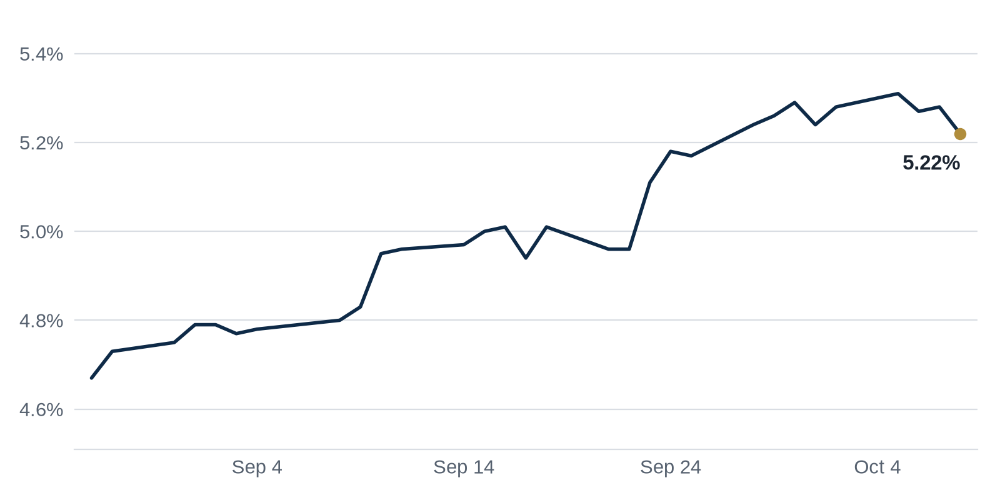

> **Review before publishing:**
> - feed/PR Newswire Real Estate: ReadTimeout: The read operation timed out
> - reits: prices from Alpha Vantage only, not cross-checked (no second source; set TIINGO_API_KEY)
> - editor: fixed: Source (Walker & Dunlop $875B 2026 maturities) does not call it a record; 'record' overclaims the title and summary.
> - editor: fixed: Source title says only 'Griffin's Real Estate Buy'; it does not give the first name Ken.
> - check/long_sentence: 34 words: (CMBS means commercial mortgage-backed securities: property loans bundled...
> - check/long_sentence: 32 words: Commercial Observer **Why it matters:** a lender funding...
> - check/long_sentence: 31 words: The Real Deal **Why it matters:** a large...
> - check/missing_link: https://news.google.com/rss/articles/CBMimgFBVV95cUxOUDVWLXZqZWhkb2EtcnlGYWR1NHhvdDFHZTlqZlBocnZDQUZQeHNLNndJSnNFSnBNV2l4UHhoZXpHS1R6anZ3dy0wZkhsUG5XTjE1MUxWVnV3U3Z6YXRNZlEzb1lEaWdvcWgtbW1FZ1ZYdnZWTGFPRUVOQl9BUml0WmxqdlMwNEs3ZVdtUzFKS3hhTEprdVN2bXBB?oc=5
> - check/missing_link: https://news.google.com/rss/articles/CBMiiwFBVV95cUxNaWZWZVZsRjJQVUQ3alF1bmgxaUFTTmdZV0N6YmIwaWtXcWJZV3hLZURhcV9xQnhwRlROQXoyeUd1VnExVlk5bVpkQU9telpJUG9lY2ZVZ0Y2d3J2a0RzVFE2TVZLYlFZOEc5R3M2c0FmOFVqamtmMk0zTVcwUG1HNkU2MFhDN1o3cFYw?oc=5
> - check/unsourced_number: Coffee chat talking points: 2020,
> - check/stale_data: Bank CRE loans last updated 2026-09-23

## The Brief

- Federal Reserve officials are split over whether September's rate increase was strong enough to cool inflation. [GlobeSt.com](https://news.google.com/rss/articles/CBMinwFBVV95cUxOQWJ0SlBHczNkcHlVdU5zR1k0V0ZLN3FnT3gyT3FZaF9naUhCSWtFQXhQU3hLQWhIYjhOLV9SUE1TOHJsbTA0elJMcUtDMlFmejlBOURnS04zVlhEenZ4OEl1NVo4QlNQemNlNl9IV1ZiUDlRRTFzdkZVVUU3SXA4UW5yci1ONkh1VjRhVk5scmFHRmRHRGZwMTZ6MzBIdUE?oc=5)
- San Francisco office leasing has passed its pre-pandemic peak as AI companies grab space across the city. [Stock Titan](https://news.google.com/rss/articles/CBMitwFBVV95cUxOTFY5anhJTnBUX3l2cTdRci0yZWRnbUdnbGNIUTI4dHRyNUZDY2Q4cVNFcjd6RkV3bjgwd3VXVDlZUjdoeVgyNVgzYzVoVGFNTHdSNU5KdWlxMmpwSndxZmMwMmh5MGFkbi1TOXA4aGxzYWYyalZnM2ZUQnJmd0YzUld1S0g3UWlBa3JTOWpoaVg5WmdicVBIZlJKQlFaZDZ5LVFWS3huSWhDc0ktV0F3ZlpPS2UwWFU?oc=5)
- A wave of commercial mortgages comes due this year, forcing owners to refinance or sell. [ScanX](https://news.google.com/rss/articles/CBMiwgFBVV95cUxONXVTUmxHdWJiYWJ3NUdCMDlNNUJZaVpkcEhUVWF6ZENTemI3LXA4YXVKUThzanVBNlN6ZzhVVWowanN4eFZSYTBxbXNJckFXZDdjQzNvWXVZOVpvVVQzRVZqdjB6anZMdjZ5bzlEY0p6TTZSd3A2X2NaekR6VjNKWGdoVDNidkk0NXZ3N3FTT2Q3T3FHMDdOOGxmdVZjblQ5SzJhNjJDSDVlWnVvc1h4b0tRVTlQbGZjcmI1emQ3WEJuUQ?oc=5)

## The Numbers

*Rates as of Oct 8 close.*

- **10Y Treasury:** 5.22% (-6 bps)
- **5Y Treasury:** 4.99% (-4 bps)
- **SOFR:** 3.87% (-1 bps)
- **Fed funds:** 3.75% to 4.00%
- **Next Fed meeting (Oct 28):** Polymarket's top outcome is No change 84.5%
- **REITs:** VNQ $89.35 (+0.7%). Best: HPP +2.1%. Worst: DLR -2.4%.
- **REIT yield vs. 10Y:** VNQ yields 3.60%, -162 bps vs. the 10Y.

**What it means:** rates barely moved, so borrowing costs are holding steady and buyers and lenders can plan deals without bracing for a sudden jump.

**Why Hudson Pacific Properties (HPP) moved:** No company-specific news today; it may have moved with other office REITs.

**Why Digital Realty (DLR) moved:** Digital Realty may have slipped because higher bond yields make its dividend less tempting, even as demand for AI data-center space stays strong. [Kalkine Media](https://news.google.com/rss/articles/CBMi1gFBVV95cUxPX2t6a3h0WkNndzhmY09lcjRkTUlGcGhNTmdWYXprY0trRHM5OVIyNEZnckdiMGJZYjFrdENXVnZoZ2ZFU0JmOUpHLU9GcUZuU3ctN1RyU1VhN3B4dmp4Vlk0MmhLdDhES1JkcWdjVWNOQmVsbHFpQ25aLURBZVh1RXJad3BHcEthakJEMURQQURHdVE5MVhHcV9qMWhEZkFQVFljczJ1WDg1N29GWkp0dWlCQmhibnJ3dWk1Zl9UZW91ZE5hN0xOSndlS19PWEFoR3d6Z1BR?oc=5)

## Debt Markets

Walker & Dunlop's 2026 outlook flags $875 billion in commercial mortgages coming due this year. Owners must refinance those loans or sell the buildings behind them. [ScanX](https://news.google.com/rss/articles/CBMiwgFBVV95cUxONXVTUmxHdWJiYWJ3NUdCMDlNNUJZaVpkcEhUVWF6ZENTemI3LXA4YXVKUThzanVBNlN6ZzhVVWowanN4eFZSYTBxbXNJckFXZDdjQzNvWXVZOVpvVVQzRVZqdjB6anZMdjZ5bzlEY0p6TTZSd3A2X2NaekR6VjNKWGdoVDNidkk0NXZ3N3FTT2Q3T3FHMDdOOGxmdVZjblQ5SzJhNjJDSDVlWnVvc1h4b0tRVTlQbGZjcmI1emQ3WEJuUQ?oc=5)
**Why it matters:** a maturity wall means many owners must find new loans at today's higher rates, and some will have to add cash or sell at a loss.

Trepp pegs income-producing CRE debt at $5.12 trillion through the second quarter, with banks holding the largest slice at $1.92 trillion. Government-backed lenders and insurers come next. [Trepp](https://www.trepp.com/trepptalk/q2-2026-cre-debt-universe)
**Why it matters:** banks hold the biggest share of CRE debt, so if they pull back on lending, owners across the market find it harder to refinance.

Connect CRE reports that multifamily and hospitality loans face the greatest refinancing risk in October among CMBS borrowers. (CMBS means commercial mortgage-backed securities: property loans bundled and sold to investors.) [Connect CRE](https://news.google.com/rss/articles/CBMipwFBVV95cUxNenJIZHNUUWVZalplUGxFR0w0SHhEUDVVRlNfVDJPMzNLTkh5cUlBN29nanRjVUJEVFktRGFIS2VVMnpwOXh0anhlcFZTaUJTVFhabzFiaWNJNzJYXzItSTVHR3hMY1FsT21DUDBHSkZmblYtc3JLYjh5UzhlUkhFTldEY1diWFhoZUg5T3d3VmFiRW9PMm9xY2pIU1Nmb1ZjMmJTdWNuUQ?oc=5)
**Why it matters:** apartment and hotel owners with maturing CMBS loans may struggle to refinance, raising the odds of defaults.

**Distress Watch:** mall values have risen 13%, yet $8.7 billion of mall loans still sit in special servicing, the workout desk where troubled loans go. [Yahoo Finance](https://news.google.com/rss/articles/CBMiigFBVV95cUxOX3JOYlRHNTY0S3F6ZTZMeElDYU9CQmZOdEVWY0xFOVJRZTZPZElGTENUeWVsVjlWblNabTJIVjZFUmlwTnc1RTJIcE4zSTBJZlFUR2hpWGthSlFsM3BORXBtdll6NWVVdnZrYzBVSFVSQlVjUjB5UnNoRzhRWF9EcjFkanJXNGtaQUE?oc=5)

## Top Stories

### Fed officials ask if September's hike went far enough
Some Federal Reserve officials now question whether the rate increase they approved in September was large enough to cool inflation. The debate keeps more tightening on the table. [GlobeSt.com](https://news.google.com/rss/articles/CBMinwFBVV95cUxOQWJ0SlBHczNkcHlVdU5zR1k0V0ZLN3FnT3gyT3FZaF9naUhCSWtFQXhQU3hLQWhIYjhOLV9SUE1TOHJsbTA0elJMcUtDMlFmejlBOURnS04zVlhEenZ4OEl1NVo4QlNQemNlNl9IV1ZiUDlRRTFzdkZVVUU3SXA4UW5yci1ONkh1VjRhVk5scmFHRmRHRGZwMTZ6MzBIdUE?oc=5)
**Why it matters:** borrowers hoping for cheaper loans soon may wait longer, and lenders will keep pricing new debt as if rates stay high.

### San Francisco office leasing passes its pre-pandemic peak
San Francisco office leasing has climbed above its pre-pandemic level, driven by a surge of AI firms signing space. Tech tenants are the main force behind the rebound. [Stock Titan](https://news.google.com/rss/articles/CBMitwFBVV95cUxOTFY5anhJTnBUX3l2cTdRci0yZWRnbUdnbGNIUTI4dHRyNUZDY2Q4cVNFcjd6RkV3bjgwd3VXVDlZUjdoeVgyNVgzYzVoVGFNTHdSNU5KdWlxMmpwSndxZmMwMmh5MGFkbi1TOXA4aGxzYWYyalZnM2ZUQnJmd0YzUld1S0g3UWlBa3JTOWpoaVg5WmdicVBIZlJKQlFaZDZ5LVFWS3huSWhDc0ktV0F3ZlpPS2UwWFU?oc=5)
**Why it matters:** landlords who sat on empty towers since 2020 can fill them again, which supports building values and makes refinancing easier.

### San Francisco apartment rents jump on the AI hiring wave
San Francisco multifamily rents rose 8.6% as AI-driven hiring pulls workers back to the city. (Multifamily means apartment buildings with many rental units.) [Yahoo Finance](https://news.google.com/rss/articles/CBMinwFBVV95cUxNNDZINWlyQnRrdUJ4YVMxeXpCOTMwSHJfbTlUSGM3cG1ORlRXVnc5MXlvdElNUG9PQVVpa1NVWGQ0VGRLckhyQ3UzWDJkbFBOTEFibHA1X281OUlHdVBkWWd5U2hpT2hfYm9OOG1FUUVsNWlMTjNOMXM2XzBienE3Y3N3YUJsSFlsWmRISXhZQjJwMTcyVi1qRG90NG5xMmc?oc=5)
**Why it matters:** apartment owners can raise rents and income, while renters face higher housing costs as tech jobs return.

**Coffee chat talking points:**

- San Francisco apartment rents jumped 8.6%, a sign the AI hiring boom is lifting housing demand alongside office space. [Yahoo Finance](https://news.google.com/rss/articles/CBMinwFBVV95cUxNNDZINWlyQnRrdUJ4YVMxeXpCOTMwSHJfbTlUSGM3cG1ORlRXVnc5MXlvdElNUG9PQVVpa1NVWGQ0VGRLckhyQ3UzWDJkbFBOTEFibHA1X281OUlHdVBkWWd5U2hpT2hfYm9OOG1FUUVsNWlMTjNOMXM2XzBienE3Y3N3YUJsSFlsWmRISXhZQjJwMTcyVi1qRG90NG5xMmc?oc=5)
- Manhattan office vacancy fell to 12.6%, its lowest since before 2020, so the office rebound reaches well beyond San Francisco. [Commercial Observer](https://commercialobserver.com/2026/10/manhattan-office-market-2026-metrics-measures/)
- TikTok just leased 1 million square feet of Atlanta warehouse, a reminder that industrial demand holds up even as office headlines dominate. [Bisnow](https://www.bisnow.com/news/atlanta/deal-sheet/tiktok-inks-massive-warehouse-lease-the-atlanta-deal-sheet)

## Market Watch

### Sun Belt
A Terra-led partnership landed a $507 million construction loan for a 28-story, 106-unit waterfront condo tower at 1250 West Avenue in Miami Beach, before sales even launched. Tyko Capital provided the financing. [Commercial Observer](https://commercialobserver.com/2026/10/terra-1250-west-miami-south-beach-tyko-gianluca-vacchi/)
**Why it matters:** a lender funding a luxury condo before pre-sales shows real confidence in Miami demand, and other developers gain a comp to cite in their own loan talks.

### West Coast
A new loan modification has again drawn attention to Bank OZK's heavy exposure to large real estate projects. The lender keeps reworking troubled loans rather than forcing defaults. [The Real Deal](https://news.google.com/rss/articles/CBMingFBVV95cUxQTkh0WU1rcHBON0dTeDN6bjNxNERINGlRVlhRdGstOWV2WS05bm9rSlhyYkxLcVlnYngyMHJobGlBNkR4WnVsbzJqTXRidldWclFJa2QtRXRrNmJkU2RodVpNS3JuWS04ZFNXczFWenlkNXo4U3BMUzhCVlB1YjdSbHl2UFdXRTViMFFmcjQ3S0dqNkhZLVhCRFVaYWZIdw?oc=5)
**Why it matters:** when a lender modifies a loan instead of foreclosing, it signals the borrower is under stress, and bank shareholders watch for losses piling up.

### International
A Hong Kong builder bought a $549 million development site, aiming to build luxury residential units. The purchase is a bet that high-end housing demand will return. [The Real Deal](https://news.google.com/rss/articles/CBMipgFBVV95cUxNYVVoc19FU0NOUzQ2S0dmWHg3WW1WQ0FnNkNSdEo4SEgzb2NMS1M3eDdUMGVldEtnbGVQSWdOdHl6MFVZR3ZWeDJmM25seGtjTnJVYnlxVlg4RVVVUEtLTy16N3lWWk14QW9iWlpFaHdDcUVhU2hQMVBFYTFqd3BkeFdtX2hzcjdtU0w4OHZzX0RObjJ3QzNYNzA0dVhDcGhpeEtxenhn?oc=5)
**Why it matters:** a large land buy at this price tells the market that developers expect wealthy buyers to come back, setting a pricing marker for nearby sites.

## Quick Hits

- Peter Linneman warns that rates, rents, and AI risks are the biggest threats facing CRE. [Bisnow](https://news.google.com/rss/articles/CBMiqwFBVV95cUxQUnZRY0Z6elRXUEh1TFBJSk9rUGhGMjk1RGYwQVJ4bUE3NWF1TzRVMkhkaGs3UHpKUkx5X3BXSEVsSWFLUUh1RGdGMDRHN0ZaeGo0Z2pGaHlTUkM3aWEtNzBTUzZ3QlE2MmNST3RXRGUzaWVmZ2toU3hfcmNodUI1VlNkX3ZETEdRNU4tV2RLdmp6VnVUdVRzQW8yb0tHVVMtWHNkUnJCVktPQkk?oc=5) A respected analyst naming the risks helps investors weigh what could go wrong before they commit capital.
- Office values are diverging sharply, with an Atlanta tower's recovery unclear and a Houston building's value plunging. [CoStar](https://news.google.com/rss/articles/CBMi2gFBVV95cUxOSk5UZ0JVQlpHTkJlbTVObGk0ZVdXQ2dUWE5GLU0yWXdDVTVuYnJBWEtSb0NzOHFJdG1UTWZabVBCRDQ0NDVGY0pPdTJLMUU4dXU0dVJSczNXODJmd3BtRlZLcUlVeGRKNUtfdlpHTHlHUzhqVUM1ZnlHdGE4WElhdC1LR0F2NXIwTDNxOC1ack5lYWc5ZEhocHl5Q2dsODVxMXBWRXhNZXdsTWJ5R0tNaUVIQW1oR2ZBUGZpem90Z0xCTGxwRl9UTTdzNVBNZ3J5MXhHcnVFbG9hUQ?oc=5) It shows office is not one market: location and quality decide which buildings hold value and which sink.
- Ytech advanced its $1.2 billion 1428 Brickell project in Miami to 30 stories. [The Real Deal](https://news.google.com/rss/articles/CBMivAFBVV95cUxPRDNjM19LS0Q2cFNNTXdPOTZySlV1RGJpXy1NTzRuQlg1bUlSXzVhMzRLYU13ZmZLNzJVOW56S3lMdXZramtLQXUxSHBmdHZLVS1IVkxoTGQ0NVVNQ2d4Q3cxWG9kbkJVbzUtNHE4RGdUOWhyMUxjakJKNDJ6di1aTlV1WFhGenVUTWkyNDdZeVp3eHU0ZERYOHhzd1VuQkpZbEZyMWhwMnpFdU5Celc3WU9HU3hWdmRkRnBDWQ?oc=5) Pushing ahead on a luxury tower signals the developer expects strong demand for high-end condos.

## Deals of the Week

- **Griffin real estate purchase, Miami:** a Miami developer gained a $1 billion windfall from Griffin's real estate buy. [Bloomberg.com](https://news.google.com/rss/articles/CBMiwAFBVV95cUxNS3dWY0Rzb0hTcGRVZU0xVS04SWFoQjlFNjBSb0tGbEd5SzVsYnFXU0NOQ2FYUzRSSG51SXljUUdydU12c1pISmU0bWhBRFJvN3lGcjlmem1rVDRLNWNSVmVmc3pzTkRVM0paMnd4OWVfNXBESFZWa2s3czNjQnR0THpPdzJSSkREZ05DalNIeHhEb1ZiNW9zZEFUUUZOc09sUldRNktwYnM5ZTI5Yk12YTdHbDhONWlFZzk0VFE2bTY?oc=5)
- **Warehouse lease, Metro Atlanta:** TikTok signed a 1 million square foot warehouse lease, and Nike and Google each leased in excess of 1 million square feet in the same market. [Bisnow](https://www.bisnow.com/news/atlanta/deal-sheet/tiktok-inks-massive-warehouse-lease-the-atlanta-deal-sheet)

## AI Infrastructure

Wall Street is marketing data centers as a major real estate play, but CNBC reports the risks are mounting as spending and supply climb. Data centers are warehouses full of servers that power cloud computing and AI. Investors chasing them could earn steady rent from tech tenants, or lose if demand cools or power supply runs short. [CNBC](https://news.google.com/rss/articles/CBMib0FVX3lxTFBETGdiVXF1QThoMXRiRUFXNWVmQUxJNHFaM051T0VjR2Y3eDVGVEppOUw2QXgtNmRxMmNMTXBNdHI0b2o4TkFqTVV3MnduUGl5ZFUzUDJKc181MkNyTmpBY01vS2JtdWk3TGlLbF9fTdIBdEFVX3lxTE45SmdXdF92d2V2NUw3Z19rLVo0Wk9rNGRURlJReGRuYXlEbHNVSEFZNURYc1VDb1F6TEViVEJfVE0yeUR3X0VhTEQ2SnJhVWlDaXMtcEpDYjEyUTBMaGQtUUJpTktKNEFuaUlXbHNVdTl0R0Zj?oc=5)

## Term of the Day

**Cap rate:** a property's yearly net operating income divided by its price. Buy a building for $10 million that nets $500,000 a year and the cap rate is 5%. A higher cap rate means a cheaper price or more risk; a lower one means buyers are paying up for safety or growth.

For informational purposes only. Not investment advice.
